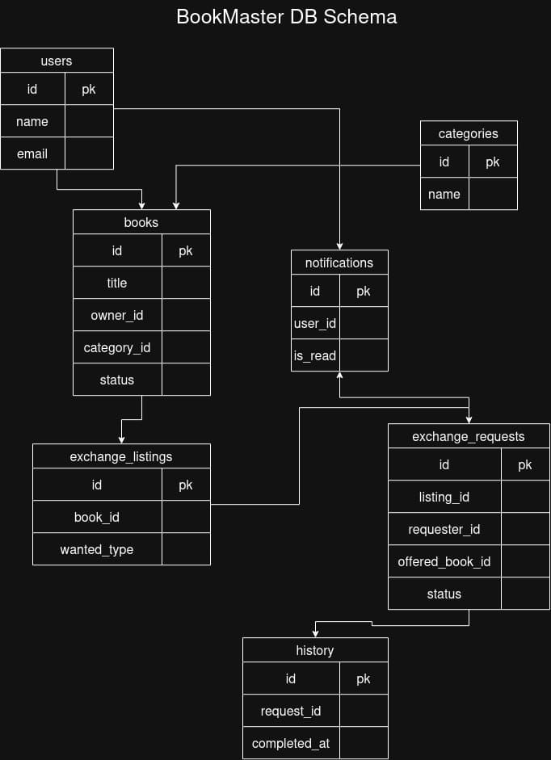

# BookMaster

BookMaster is a digital book ownership and peer-to-peer exchange platform. It allows users to manage their personal library, list owned books for exchange, discover available listings, and exchange books with other users.

## Features

- User registration and authentication
- Personal digital book library
- Book search, browsing, and filtering
- Exchange listings and exchange requests
- Accept or reject exchange requests
- Ownership transfer after successful exchanges
- Exchange history and notifications
- Wishlist, ratings, and reviews
- Administrative management of users, books, categories, and exchange activity

## Requirements

BookMaster should provide secure access control, maintain accurate ownership data, prevent conflicting exchanges, and ensure that exchange operations complete consistently. The application should also use a modular and maintainable architecture.

## Main Roles

- **User:** Manages books, participates in exchanges, and views exchange history.
- **Administrator:** Manages users, books, categories, listings, and platform activity.

## Core Flow

1. A user adds or owns books in their personal library.
2. The user lists a book for exchange and specifies what they are looking for.
3. Other users browse listings and submit exchange requests with an offered book.
4. The listing owner accepts or rejects a request.
5. After acceptance, ownership is transferred and the exchange is recorded.

For the full functional and non-functional requirements, refer to the accompanying requirement analysis document.

## Database Design

The current database implementation uses **MySQL**. The database design is documented in the following diagram:

The database layer is currently designed for MySQL, with **Microsoft SQL Server** planned as the target database for a future migration.

## Developers

- IN26015092	Akshat Jaiswal
- IN26013135	Prathvi Raj Singh Rathod
- IN26013590	Aanis Ali Shah
- IN26014327	Ayush Singh
- IN26014815	Gautam Kumar
- IN26014395	Anuj rai
